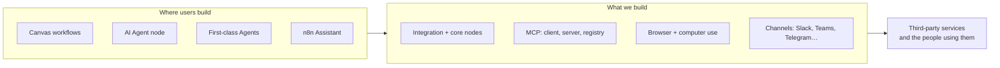
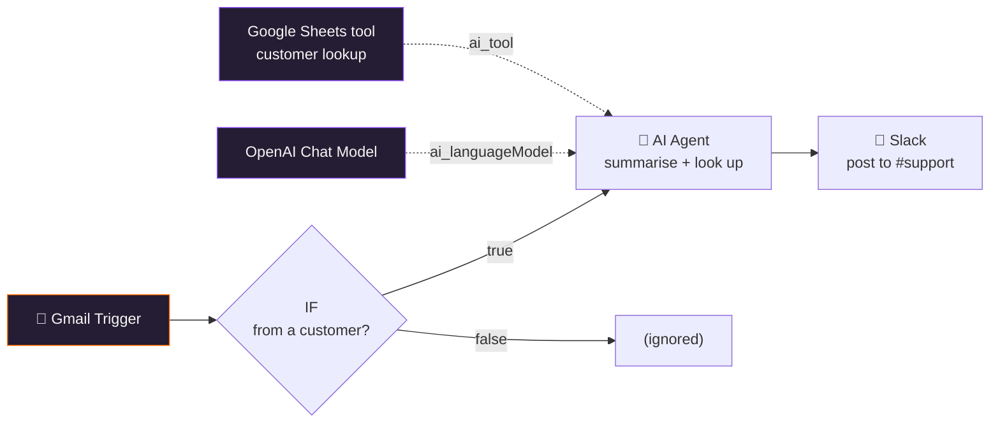
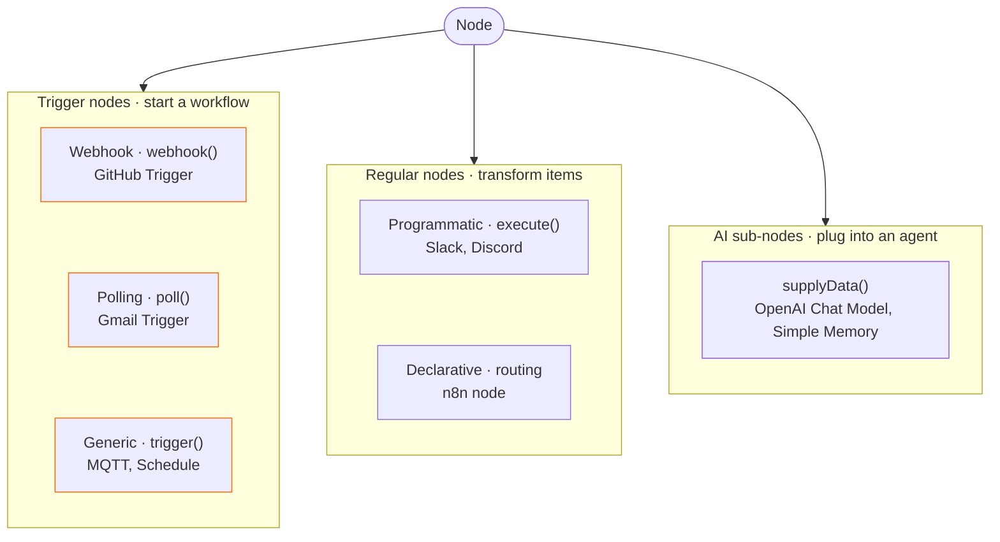
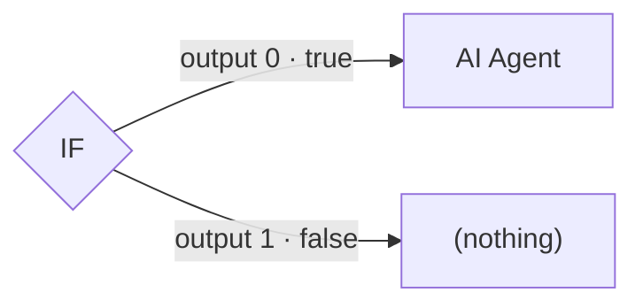
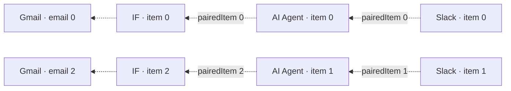
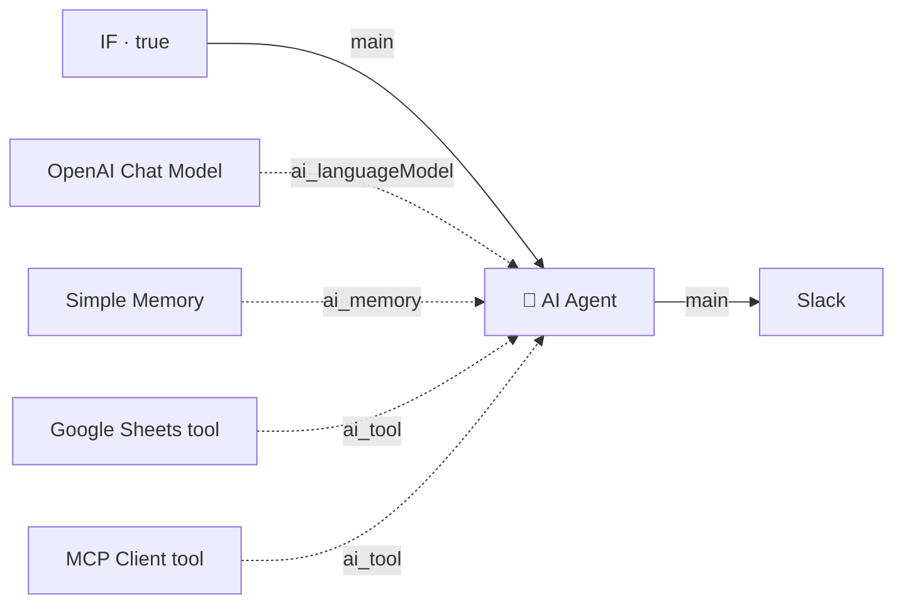

<div class="cover-wrap">
  
  <div class="cover-kicker">Engineering onboarding</div>
  <h1 class="cover-title">How <span class="accent">nodes</span> work</h1>
  <div class="cover-sub">…and the team that connects n8n to everything else</div>
  <div class="cover-pills">
    <span class="pill">Nodes team</span>
    <span class="pill gray">#team-nodes</span>
  </div>
</div>

<!--
- Welcome, introduce yourself (name, role, how long at n8n)
- ~60 min: ~10 min team + ecosystem, ~40 min engineering, Q&A at the end
- Questions any time; the session is recorded for people who can't join
- Deck stays conceptual; every slide links to code or to the Notion "Nodes onboarding" page for details
-->

---

# Agenda

<div class="grid grid-cols-3 gap-4">
  <div class="card agenda pink"><h3>01</h3><h2>Team &amp; ecosystem</h2><p class="muted mt-2">Who we are, what we own</p></div>
  <div class="card agenda"><h3>02</h3><h2>How a node works</h2><p class="muted mt-2">Description + function</p></div>
  <div class="card agenda"><h3>03</h3><h2>Triggers</h2><p class="muted mt-2">Webhook · polling · generic</p></div>
  <div class="card agenda"><h3>04</h3><h2>Data flow</h2><p class="muted mt-2">Items, outputs, pairedItem</p></div>
  <div class="card agenda"><h3>05</h3><h2>Building nodes</h2><p class="muted mt-2">Declarative, parameters, credentials, versions</p></div>
  <div class="card agenda orange"><h3>06</h3><h2>AI nodes</h2><p class="muted mt-2">Connection types, supplyData</p></div>
</div>

<p class="statement mt-8">One <span class="accent">running example</span> ties it all together.</p>

<!--
- Two halves: first who we are, then the engineering deep dive
- The deep dive follows one workflow that we come back to in each section
- Not covered on slides: testing, error handling, local dev, community nodes. Links at the end
-->

---
layout: section
---

<div class="section-number">01</div>

# Team &amp; <span class="accent">ecosystem</span>

<!--
- ~10 minutes: mission, history, what we own, the new areas, the people
-->

---

# Integrations, everywhere

<div class="statement">Wherever n8n connects to the <span class="accent">outside world</span>,<br/>that's us.</div>

<div class="grid grid-cols-2 gap-6 mt-10">
  <div class="card">
    <h3>Mission</h3>
    <p>Build a thriving node ecosystem: empower developers to ship high-quality, relevant integrations, and let users build business-critical workflows through a powerful core node experience.</p>
  </div>
  <div class="card pink">
    <h3>Where we're heading</h3>
    <p>We build the tools that agents and people use to get things done: integration and core nodes, MCP, browser and computer use, and the human touchpoints of automation like forms, channels and approvals.</p>
  </div>
</div>

<!--
- The slogan came out of our onboarding revamp discussion. Nodes are the artifact; connecting n8n to other systems is the job
- Left: the official mission from the Team Nodes Notion page
- Right: the Q4 2026 mission reframe draft ("Nodes team Q3-2026 learnings & Q4 outlook")
- The shift: we used to mean "nodes on a canvas"; now it's canvas, agents, n8n Assistant and MCP
-->

---

# From nodes to <span class="accent">ecosystem</span>

<div class="timeline mt-6" style="grid-template-columns: repeat(4, 1fr)">
  <div class="tl-item"><div class="tl-dot"></div><div class="tl-ver">Team Nodes</div><div class="tl-txt">Build and maintain the nodes — the way n8n reaches other tools</div></div>
  <div class="tl-item"><div class="tl-dot"></div><div class="tl-ver">Community</div><div class="tl-txt">Community and verified nodes: others build connections too</div></div>
  <div class="tl-item"><div class="tl-dot"></div><div class="tl-ver">2026 · Ecosystem</div><div class="tl-txt">Domain split into Community, Ecosystem Experience, Ecosystem Services</div></div>
  <div class="tl-item ga"><div class="tl-dot"></div><div class="tl-ver">Q3–Q4 2026</div><div class="tl-txt">MCP registry, browser use, channels for agents</div></div>
</div>

<blockquote class="mt-10"><p>The name always described the <strong>artifact</strong>, not the <strong>domain</strong>. Nodes were never the point — reaching the tools users live in was.</p></blockquote>

<p class="mt-4"><span class="pill orange">[Presenter: add founding year, team size over time, key milestones]</span></p>

<!--
- Source: Notion "Ecosystem — Domain & Team Structure" (Mar 2026) and "Nodes team Q3-2026 learnings & Q4 outlook"
- Ecosystem = "how n8n extends its reach": connecting (nodes, APIs), abstracting (AI Gateway / n8n Connect), embedding (voice, browser), surfacing (marketplace)
- Three teams in the domain: Community (open contribution layer), Ecosystem Experience (AI Gateway, managed access), Ecosystem Services (node framework, standards, first-party integrations)
- [Presenter: fill in the early history and how the current Nodes team maps to the three teams]
-->

---

# The ecosystem map



<!--
- Left: the places a user builds something in n8n
- Middle: the pieces our team owns that reach outside n8n
- Right: the outside world: APIs, SaaS tools, browsers, chat apps, the humans on the other end
- n8n Assistant (Instance AI in code) still produces workflows made of our nodes. A bug in what the Assistant built is often a node bug
- First-class Agents use our MCP tools and channels directly, no canvas involved
-->

---

# What we <span class="accent">own</span>

<div class="grid grid-cols-4 gap-4">
  <div class="card pink"><span class="icon">🧩</span><h2>Integration nodes</h2><p>Slack, Google Sheets, HubSpot… 400+ built-in</p></div>
  <div class="card"><span class="icon">⚙️</span><h2>Core nodes</h2><p>Code, HTTP Request, IF, Merge, triggers</p></div>
  <div class="card"><span class="icon">🌍</span><h2>Community nodes</h2><p>Loading, vetting, verified nodes</p></div>
  <div class="card purple"><span class="icon">🔌</span><h2>MCP</h2><p>Client Tool, Server Trigger, Registry</p></div>
  <div class="card orange"><span class="icon">🤖</span><h2>AI provider nodes</h2><p>Standalone OpenAI, Anthropic, Gemini…</p></div>
  <div class="card"><span class="icon">📏</span><h2>Evaluation nodes</h2><p>Evaluate workflows and agents</p></div>
  <div class="card mint"><span class="icon">🌐</span><h2>Agent capabilities</h2><p>Browser use, computer use, channels</p></div>
  <div class="card"><span class="icon">⚡</span><h2>Building experience</h2><p>Quick Connect, schema preview</p></div>
</div>

<!--
- Source: "We own" list on the Team Nodes Notion page
- If a bug or question lands on one of these, it's ours; route it to #team-nodes
- 400+: packages/nodes-base/package.json registers 442 node files (actions and triggers) at n8n master @ 52db75973e
-->

---

# MCP <span class="accent">registry</span>

<div class="grid grid-cols-5 gap-8 mt-2">
<div class="col-span-3">
<div class="flow">
  <div class="fstep"><div class="n">Sync</div><div class="t">Registry API</div><div class="d">Curated list of remote MCP servers, refreshed by a system task</div></div>
  <div class="fstep pink"><div class="n">Load</div><div class="t">A node per server</div><div class="d">A node loader turns each server into a tool node</div></div>
  <div class="fstep"><div class="n">Use</div><div class="t">Everywhere</div><div class="d">AI Agent node, n8n Assistant connections, first-class Agents</div></div>
</div>
</div>
<div class="col-span-2 flex flex-col justify-center">
  <p class="big-line">Third-party MCP servers, <strong>as nodes.</strong></p>
  <div class="file-ref mt-4">packages/cli/src/modules/mcp-registry/</div>
</div>
</div>

<!--
- What: a curated catalog of official remote MCP servers (Notion, Linear, …) that users can connect with one click
- How: a backend module syncs the catalog (McpRegistryRefreshTask). McpRegistryNodeLoader registers a node for each server, backed by the McpRegistryClientTool runtime class
- Why it matters for this talk: it reuses the exact node machinery we'll see next. A registry entry is "just" a node description generated at runtime
- Direction: credential unification. Connecting a service once should work for both the Assistant and workflows
- Hub: Notion "MCP Registry Hub"
-->

---

# Channels for <span class="accent">agents</span>

<div class="grid grid-cols-2 gap-10 mt-2">
<div>
  <p class="big-line">Talk to a first-class Agent<br/><strong>where people already are.</strong></p>
  <div class="principles small-set mt-6" style="justify-content: flex-start">
    <span>Slack</span><span>Microsoft Teams</span><span>Telegram</span><span>Discord</span><span>Linear</span><span>n8n Chat</span>
  </div>
</div>
<div class="card">
  <h3>How it's built</h3>
  <ul>
    <li>Vercel Chat SDK: <code>chat</code> + <code>@chat-adapter/*</code></li>
    <li>One integration per platform: setup, streaming, approvals</li>
    <li>Human-in-the-loop cards for tool approvals</li>
  </ul>
  <p class="file-ref mt-4">packages/cli/src/modules/agents/<br/>integrations/platforms/</p>
</div>
</div>

<!--
- First-class Agents are a separate artifact from workflows. Channels are how users reach them
- Each platform: an integration file (slack-integration.ts, teams-integration.ts, …) plus setup services
- Shared pieces: chat bridge, stream consumer, HITL resume handler, rate limiting
- More channels in progress (WhatsApp, web, email, voice are on the list)
- Gold standards: Notion "Agent Channels - Gold Standards"
-->

---

# Browser <span class="accent">use</span>

<div class="flow mt-2">
  <div class="fstep"><div class="n">Agent</div><div class="t">n8n Assistant / Agent</div><div class="d">Decides it needs a browser</div></div>
  <div class="fstep pink"><div class="n">MCP server</div><div class="t"><code>@n8n/mcp-browser</code></div><div class="d">Browser tools, returns accessibility snapshots</div></div>
  <div class="fstep"><div class="n">Extension</div><div class="t">n8n AI Browser Bridge</div><div class="d">Chrome extension, relays CDP</div></div>
  <div class="fstep"><div class="n">Browser</div><div class="t">User's real Chrome</div><div class="d">Real profile, cookies, sessions</div></div>
</div>

<p class="statement mt-10">For the tasks <span class="accent">no API covers.</span></p>

<p class="file-ref text-center mt-4">packages/@n8n/mcp-browser · packages/@n8n/mcp-browser-extension</p>

<!--
- What: lets an agent drive the user's own browser (ERP forms, ad dashboards, gated logins)
- Started as "let AI set up my credential" experiment; that stopped, browser use as a general tool goes GA
- Research: users trust AI with their browser far more than with their whole computer
- Computer use is the sibling project (Notion "Computer Use & Browser Use Hub")
-->

---

# The <span class="accent">people</span>

<div class="grid grid-cols-4 gap-3">
  <div class="card pink"><h2>Shireen Missi</h2><p class="muted">Team manager</p></div>
  <div class="card"><h2>Elias Meire</h2><p class="muted">[Presenter: role · ask about]</p></div>
  <div class="card"><h2>Bernhard Wittmann</h2><p class="muted">[Presenter: role · ask about]</p></div>
  <div class="card"><h2>Toni Devine</h2><p class="muted">[Presenter: role · ask about]</p></div>
  <div class="card"><h2>Roman Davydchuk</h2><p class="muted">[Presenter: role · ask about]</p></div>
  <div class="card"><h2>Yehor Kardash</h2><p class="muted">[Presenter: role · ask about]</p></div>
  <div class="card"><h2>Dimitri Lavrenük</h2><p class="muted">[Presenter: role · ask about]</p></div>
  <div class="card"><h2>Alejandro Carrasco</h2><p class="muted">[Presenter: role · ask about]</p></div>
  <div class="card"><h2>Vlad Morozov</h2><p class="muted">[Presenter: role · ask about]</p></div>
  <div class="card"><h2>David Arens</h2><p class="muted">[Presenter: role · ask about]</p></div>
  <div class="card"><h2>Jake Ranallo</h2><p class="muted">[Presenter: role · ask about]</p></div>
  <div class="card mint"><h2>Reach us</h2><p><code>#team-nodes</code><br/><code>#team-nodes-review</code></p></div>
</div>

<!--
- Members from the Team Nodes Notion page; manager per the page's "Reach us" callout
- [Presenter: fill in role and "ask me about" for each person; check the list is current]
- #team-nodes for questions and bug reports, #team-nodes-review for PR review requests
- Rituals: daily standup 10:15 CET, weekly team sync Thursday, monthly retro
-->

---

# The running <span class="accent">example</span>



<p class="text-center muted small mt-2">New customer email → decide → summarise with AI → notify the team</p>

<!--
- A small, realistic support workflow. We'll come back to it in every section
- Gmail Trigger: a polling trigger (section 03)
- IF: two outputs, true and false (section 04)
- AI Agent with a model and a tool attached through AI connections (section 06)
- Slack: a classic programmatic integration node (section 05)
-->

---
layout: section
---

<div class="section-number">02</div>

# How a node <span class="accent">works</span>

<!--
- The core mental model. If you remember one thing: description + function
-->

---

# A node = <span class="accent">description</span> + <span class="accent">function</span>

<h3>In the editor</h3>
<div class="flow mb-6">
  <div class="fstep pink"><div class="n">description</div><div class="t"><code>INodeTypeDescription</code></div><div class="d">Name, icon, inputs, outputs, credentials, parameters</div></div>
  <div class="fstep"><div class="n">frontend</div><div class="t">NDV</div><div class="d">Parameters UI rendered from the description</div></div>
  <div class="fstep"><div class="n">user config</div><div class="t">Workflow JSON</div><div class="d">Parameter values saved per node</div></div>
</div>

<h3>At run time</h3>
<div class="flow">
  <div class="fstep"><div class="n">input</div><div class="t">Items from previous node</div><div class="d">Plus the saved parameters</div></div>
  <div class="fstep"><div class="n">engine</div><div class="t">Workflow engine</div><div class="d">Picks the right method</div></div>
  <div class="fstep pink"><div class="n">function</div><div class="t"><code>execute()</code> · <code>poll()</code> · <code>webhook()</code> · <code>supplyData()</code></div><div class="d">Returns items to the next node</div></div>
</div>

<p class="statement mt-8">Nodes ship <span class="accent">no UI code.</span></p>

<!--
- The description is plain data: name, icon, inputs/outputs, credentials, parameters
- The frontend renders the NDV (node details view) purely from that description
- The user's choices are stored as parameters in the workflow JSON
- At run time the engine hands the node its input items and calls the function
- Consequence: a new node never touches the editor-ui package
-->

---

# Anatomy of <code>INodeType</code>

<div class="grid grid-cols-3 gap-8 items-center">
<div class="col-span-2 code-sm">

```ts
export class Example implements INodeType {
  description: INodeTypeDescription;

  // run methods: implement the one that fits
  execute?(this: IExecuteFunctions): Promise<NodeOutput>;
  poll?(this: IPollFunctions): Promise<INodeExecutionData[][] | null>;
  trigger?(this: ITriggerFunctions): Promise<ITriggerResponse>;
  webhook?(this: IWebhookFunctions): Promise<IWebhookResponseData>;
  supplyData?(this: ISupplyDataFunctions, i: number): Promise<SupplyData>;

  methods?: { loadOptions, listSearch, credentialTest, … };
  webhookMethods?: { default: { checkExists, create, delete } };
}
```

</div>
<div>
  <p class="big-line">One class.</p>
  <p class="big-line mt-2">Implement <strong>the method that fits</strong> the node type.</p>
  <div class="file-ref mt-6">packages/workflow/src/interfaces.ts</div>
</div>
</div>

<!--
- Simplified from the real interface; methods and webhookMethods have more options
- execute: regular programmatic nodes. poll / trigger / webhook: the three trigger kinds. supplyData: AI sub-nodes
- methods: backend helpers the UI calls while you configure the node: dropdown options, searchable lists, credential tests, resource mapper fields
- webhookMethods: register/unregister webhooks with the third-party service
- Declarative nodes implement none of the run methods; they describe HTTP requests instead (section 05)
-->

---

# How a node gets <span class="accent">into the app</span>

<div class="flow mt-4">
  <div class="fstep"><div class="n">1 · Declare</div><div class="t"><code>package.json</code></div><div class="d"><code>n8n.nodes</code> lists the built <code>*.node.js</code> files</div></div>
  <div class="fstep"><div class="n">2 · Load</div><div class="t">Directory loader</div><div class="d">Imports each class, reads its description</div></div>
  <div class="fstep"><div class="n">3 · Register</div><div class="t">Node types registry</div><div class="d">Backend knows the type + version</div></div>
  <div class="fstep pink"><div class="n">4 · Render</div><div class="t">Nodes panel + NDV</div><div class="d">Frontend fetches descriptions</div></div>
</div>

<div class="grid grid-cols-2 gap-6 mt-10">
  <div class="card"><h3>Built-in</h3><p><code>packages/nodes-base</code> and <code>packages/@n8n/nodes-langchain</code></p></div>
  <div class="card"><h3>Also nodes</h3><p>Community packages (<code>n8n-nodes-*</code>) and MCP registry servers — different loaders, same registry</p></div>
</div>

<div class="file-ref mt-4">packages/core/src/nodes-loader/directory-loader.ts</div>

<!--
- A new built-in node needs its built .js path added to n8n.nodes in packages/nodes-base/package.json (credentials under n8n.credentials)
- The directory loader also post-processes descriptions, e.g. it injects "Poll Times" for polling triggers (next section)
- Community nodes: PackageDirectoryLoader reads the same n8n field from an npm package
- MCP registry: its own NodeLoader generates descriptions at runtime
-->

---

# Node <span class="accent">types</span>



<!--
- Keep this tree in mind; the next sections walk down each branch
- Running example: Gmail Trigger = polling, IF + Slack = programmatic, OpenAI Chat Model + Sheets tool = AI sub-nodes
- The AI Agent node itself is a regular programmatic node (execute) that consumes sub-nodes
- One node can be several things: many nodes are usable as tools, and some offer trigger + action variants
-->

---
layout: section
---

<div class="section-number">03</div>

# <span class="accent">Triggers</span>

<!--
- Every workflow starts with a trigger. Three kinds, three very different runtime behaviours
-->

---

# Three ways to <span class="accent">start</span> a workflow

<div class="grid grid-cols-3 gap-5">
  <div class="card pink">
    <h3>Webhook</h3>
    <h2>They call us</h2>
    <p>The service sends an HTTP request when something happens.</p>
    <p class="muted mt-3">GitHub, Stripe, Slack, Teams</p>
  </div>
  <div class="card orange">
    <h3>Polling <span class="pill orange ml-1">↩ example</span></h3>
    <h2>We ask them</h2>
    <p>n8n checks for new data on a schedule.</p>
    <p class="muted mt-3">Gmail, Google Sheets, RSS</p>
  </div>
  <div class="card purple">
    <h3>Generic</h3>
    <h2>We keep listening</h2>
    <p>A long-lived connection or timer while the workflow is active.</p>
    <p class="muted mt-3">MQTT, AMQP, Kafka, Schedule</p>
  </div>
</div>

<p class="statement mt-10">Pick by what the <span class="accent">service</span> supports.</p>

<!--
- Webhook: best latency and cheapest, but the service must support webhooks and reach our instance
- Polling: works with any API that can list "things since X". Our Gmail Trigger is one
- Generic: message brokers and timers; n8n holds a connection open while the workflow is published
- Other teams hit this too: scheduling/queue work had to account for polling triggers specifically
-->

---

# Webhook triggers

<div class="flow mt-2">
  <div class="fstep"><div class="n">Activate</div><div class="t"><code>checkExists()</code></div><div class="d">Is our webhook already registered?</div></div>
  <div class="fstep"><div class="n">If not</div><div class="t"><code>create()</code></div><div class="d">Register our URL with the service</div></div>
  <div class="fstep pink"><div class="n">On event</div><div class="t"><code>webhook()</code></div><div class="d">Verify, then emit items</div></div>
  <div class="fstep"><div class="n">Deactivate</div><div class="t"><code>delete()</code></div><div class="d">Unregister the webhook</div></div>
</div>

<div class="grid grid-cols-2 gap-8 mt-8 items-center">
<div>

```ts
const expected = createHmac('sha256', secret)
  .update(rawBody)
  .digest('hex');
const valid = timingSafeEqual(
  Buffer.from(expected),
  Buffer.from(signature),
);
if (!valid) return { workflowData: [] }; // do not fire
```

</div>
<div>
  <p class="big-line">Always <strong>verify the signature</strong> before you trust the payload.</p>
  <div class="file-ref mt-4">nodes/GitHub/GithubTriggerHelpers.ts</div>
</div>
</div>

<!--
- The lifecycle lives in webhookMethods: checkExists / create / delete
- create runs when the workflow is published or n8n starts, and only if checkExists returns false
- Services sign requests: usually HMAC over the raw body (sometimes + timestamp) compared to a header
- Compare with crypto.timingSafeEqual. On mismatch return empty workflowData so nothing runs
- Example node: packages/nodes-base/nodes/Microsoft/Teams/MicrosoftTeamsTrigger.node.ts
-->

---

# Polling triggers <span class="pill orange ml-2">↩ Gmail Trigger</span>

<div class="grid grid-cols-5 gap-8 items-center">
<div class="col-span-3">

```ts
description = { /* … */ polling: true };

async poll(this: IPollFunctions) {
  const state = this.getWorkflowStaticData('node');
  const since = state.lastTimeChecked ?? startDate;

  const emails = await fetchEmailsSince(since);
  state.lastTimeChecked = now;

  if (!emails.length) return null; // nothing new, no run
  return [this.helpers.returnJsonArray(emails)];
}
```

</div>
<div class="col-span-2">
  <ul>
    <li><code>polling: true</code> → loader injects a <strong>Poll Times</strong> parameter</li>
    <li>Core calls <code>poll()</code> on that schedule</li>
    <li><strong>Static data</strong> remembers where we left off</li>
    <li>Return <code>null</code> → no execution</li>
  </ul>
  <div class="file-ref mt-4">nodes/Google/Gmail/GmailTrigger.node.ts</div>
</div>
</div>

<!--
- Simplified from GmailTrigger; the real one also dedupes by message id
- Poll Times is defined in packages/core/src/nodes-loader/constants.ts and added by the directory loader
- getWorkflowStaticData('node') is persisted with the workflow; that's how we return only new items
- Classic bug class: static data not updated, or updated before a failure → duplicates or missed items
-->

---

# Generic triggers

<div class="grid grid-cols-5 gap-8 items-center">
<div class="col-span-3">

```ts
async trigger(this: ITriggerFunctions) {
  const client = await connect(credentials);

  client.on('message', (topic, message) => {
    this.emit([this.helpers.returnJsonArray({ topic, message })]);
  });

  return {
    closeFunction: async () => client.end(),
  };
}
```

</div>
<div class="col-span-2">
  <ul>
    <li>Called <strong>once</strong> when the workflow is published</li>
    <li><code>this.emit()</code> starts a run, any time</li>
    <li><code>closeFunction</code> cleans up on unpublish</li>
  </ul>
  <p class="file-ref mt-4">nodes/MQTT/MqttTrigger.node.ts<br/>nodes/Amqp/AmqpTrigger.node.ts<br/>nodes/Schedule/ScheduleTrigger.node.ts</p>
</div>
</div>

<!--
- Anything that is not polling or webhook: usually a third-party SDK holding a connection open
- Schedule Trigger is also generic: it registers cron jobs and emits on each tick
- manualTriggerFunction (not shown) powers "Test workflow" in the editor
- Watch out: connection drops. If the SDK errors and we don't handle it, the trigger silently stops or crashes the process
-->

---
layout: section
---

<div class="section-number">04</div>

# Data <span class="accent">flow</span>

<!--
- How data moves between nodes. This is the part that bites everyone, including other teams
-->

---

# Everything is a list of <span class="accent">items</span>

<div class="grid grid-cols-2 gap-10 items-center">
<div>

```ts
interface INodeExecutionData {
  // the data, JSON-serializable
  json: IDataObject;

  // file metadata; bytes live in the store
  binary?: IBinaryKeyData;

  // input item(s) this item came from
  pairedItem?: IPairedItemData | IPairedItemData[];
}
```

</div>
<div>
  <div class="card mb-4"><h3>json</h3><p>The data. <code>{ from, subject, body }</code> for each email</p></div>
  <div class="card mb-4"><h3>binary</h3><p>Files: attachments, PDFs, images</p></div>
  <div class="card"><h3>pairedItem</h3><p>Lineage back to the input item</p></div>
</div>
</div>

<!--
- Nodes receive an array of items and return an array of items
- Gmail Trigger with 3 new emails → 3 items → IF runs its logic once per item
- json must survive JSON.stringify: no class instances, no Buffers
- binary holds metadata only (fileName, mimeType, id); the bytes live in the filesystem or S3 store
- pairedItem also accepts a plain number as shorthand (omitted on the slide)
-->

---

# One array <span class="accent">per output</span> <span class="pill orange ml-2">↩ IF</span>

<div class="grid grid-cols-2 gap-10 items-center">
<div>

```ts
// return type of execute()
INodeExecutionData[][]

// most nodes: one output
return [items];

// IF: two outputs
return [trueItems, falseItems];
```

</div>
<div>



<p class="mt-4">The description declares the outputs:<br/><code>outputs: [Main, Main]</code></p>

</div>
</div>

<!--
- Outer array = output connections, inner array = the items on that output
- IF, Switch, Compare Datasets: several outputs. Merge: several inputs
- Items routed to an unwired output are simply dropped: that's expected, not a bug
- An empty array on an output means downstream nodes on that branch don't run
-->

---

# The execute <span class="accent">loop</span>

<div class="grid grid-cols-5 gap-8 items-center">
<div class="col-span-3">

```ts
const items = this.getInputData();
const returnData: INodeExecutionData[] = [];

for (let i = 0; i < items.length; i++) {
  const channel = this.getNodeParameter('channel', i) as string;
  const text = this.getNodeParameter('text', i) as string;

  const response = await this.helpers.httpRequestWithAuthentication
    .call(this, 'slackOAuth2Api', buildRequest(channel, text));

  returnData.push({ json: response, pairedItem: { item: i } });
}
return [returnData];
```

</div>
<div class="col-span-2">
  <p class="big-line">Read parameters <strong>per item.</strong></p>
  <p class="mt-4" v-pre><code>={{ $json.subject }}</code> resolves differently for every email.</p>
  <div class="file-ref mt-4">nodes/Slack/V2/SlackV2.node.ts</div>
</div>
</div>

<!--
- Simplified: the real Slack node builds requests in V2/GenericFunctions.ts
- Slack at the end of our running example posts one message per incoming item
- Parameter values starting with "=" are expressions, resolved when getNodeParameter(name, i) is called
- That's why the item index is passed everywhere
- Use the helpers for HTTP: httpRequestWithAuthentication applies the credential for you
-->

---

# Binary data, <span class="accent">by reference</span>

<div class="flow mt-4">
  <div class="fstep"><div class="n">Item</div><div class="t"><code>binary.data</code></div><div class="d">fileName, mimeType, id</div></div>
  <div class="fstep"><div class="n">Store</div><div class="t">Binary data store</div><div class="d">Filesystem, S3 or DB</div></div>
  <div class="fstep pink"><div class="n">Node</div><div class="t">Helpers</div><div class="d">Read and write through core</div></div>
</div>

<div class="mt-8">

```ts
const buffer = await this.helpers.getBinaryDataBuffer(i, 'data');
const file = await this.helpers.prepareBinaryData(buffer, 'report.pdf', 'application/pdf');
returnData.push({ json: {}, binary: { data: file }, pairedItem: { item: i } });
```

</div>

<p class="statement mt-6">Never read <code>item.binary.data</code> directly.</p>

<!--
- In our example: Gmail Trigger can download attachments as binary properties
- The item only carries a reference; the bytes may be on disk or in S3
- getBinaryDataBuffer resolves the reference; prepareBinaryData stores new files
- Reading the property directly works in dev (default mode) and breaks in production setups
-->

---

# <code>pairedItem</code>: item <span class="accent">lineage</span>



<p class="text-center mt-4" v-pre><code>{{ $('Gmail Trigger').item.json.subject }}</code> in Slack follows these links back.</p>

<!--
- Each output item points at the input item it came from
- Expressions like $('Node').item walk this chain backwards
- Here email 1 went to IF's false branch, so AI Agent item 1 maps back to IF item 2
- Missing or wrong pairedItem → "Can't determine which item to use" in the UI
- The team keeps a "pairedItem Issues Log" in Notion; it's a recurring bug class
-->

---
layout: section
---

<div class="section-number">05</div>

# Building <span class="accent">nodes</span>

<!--
- Two styles to write a node, then the building blocks: parameters, credentials, versions
-->

---

# Declarative vs <span class="accent">programmatic</span>

<div class="grid grid-cols-2 gap-6">
<div class="card">
  <h3>Declarative · <code>routing</code></h3>

```ts
{
  name: 'Get Many',
  value: 'getAll',
  routing: {
    request: { method: 'GET', url: '/workflows' },
    send: { paginate: true },
  },
}
```

  <p class="mt-2">Describe the HTTP request. n8n runs it.</p>
  <div class="file-ref mt-2">nodes/N8n/WorkflowDescription.ts</div>
</div>
<div class="card pink">
  <h3>Programmatic · <code>execute()</code></h3>

```ts
async execute(this: IExecuteFunctions) {
  const items = this.getInputData();
  for (let i = 0; i < items.length; i++) {
    // any logic, any SDK, any protocol
  }
  return [returnData];
}
```

  <p class="mt-2">Full control. More code to maintain.</p>
  <div class="file-ref mt-2">nodes/Discord/v2/DiscordV2.node.ts</div>
</div>
</div>

<!--
- Declarative: plain REST APIs. requestDefaults on the description sets baseURL and headers; each operation adds routing
- customOperations is the escape hatch when one operation needs imperative code
- Programmatic: non-HTTP protocols, SDKs, complex pagination or data shaping. Most of our core nodes
- Rule of thumb: start declarative if the API is simple REST
- Docs: "Build a declarative-style node" and "Build a programmatic-style node" tutorials
-->

---

# Parameters: <span class="accent">resource</span> → <span class="accent">operation</span>

<div class="grid grid-cols-3 gap-8 items-center">
<div class="col-span-2 code-sm">

```ts
properties: [
  { displayName: 'Resource', name: 'resource', type: 'options',
    options: [{ name: 'Message', value: 'message' }, …],
    default: 'message' },
  { displayName: 'Operation', name: 'operation', type: 'options',
    displayOptions: { show: { resource: ['message'] } },
    options: [{ name: 'Send', value: 'post', action: 'Send a message' }],
    default: 'post' },
  { displayName: 'Channel', name: 'channelId', type: 'resourceLocator',
    modes: [{ name: 'list', type: 'list',
      typeOptions: { searchListMethod: 'getChannels' } }, …],
    displayOptions: { show: { resource: ['message'] } },
    default: { mode: 'list', value: '' } },
]
```

</div>
<div>
  <ul>
    <li><strong>Resource + operation</strong> = the actions in the nodes panel</li>
    <li><code>displayOptions</code> show fields only when relevant</li>
    <li><strong>Resource locator</strong>: pick from list, by ID or by URL</li>
    <li><code>loadOptions</code> / <code>listSearch</code> fill dropdowns from the API</li>
  </ul>
</div>
</div>

<!--
- Simplified from the Slack node: Resource "Message", Operation "Send", then the channel field
- Every combination of resource + operation becomes an action users can search in the nodes panel ("Slack: Send a message")
- displayOptions is the main tool to keep the NDV small
- Resource locator + searchListMethod lets users pick a channel instead of pasting IDs
- Full list of parameter types: docs "Node UI elements"
-->

---

# <span class="accent">Credentials</span>

<div class="grid grid-cols-3 gap-8 items-center">
<div class="col-span-2 code-sm">

```ts
export class OpenAiApi implements ICredentialType {
  name = 'openAiApi';
  displayName = 'OpenAI';
  properties = [{ displayName: 'API Key', name: 'apiKey', type: 'string',
    typeOptions: { password: true }, default: '' }];

  async authenticate(credentials, requestOptions) {
    requestOptions.headers ??= {};
    requestOptions.headers.Authorization = `Bearer ${credentials.apiKey}`;
    return requestOptions;
  }

  test = { request: { baseURL: '={{$credentials?.url}}', url: '/models' } };
}
```

</div>
<div>
  <ul>
    <li>One class per file in <code>credentials/</code></li>
    <li><code>authenticate</code> injects auth into requests</li>
    <li><code>test</code> powers the green check</li>
    <li>OAuth2: <code>extends: ['oAuth2Api']</code>, n8n runs the flow</li>
  </ul>
  <p class="mt-4">Node side: <code>credentials: [{ name: 'openAiApi' }]</code></p>
</div>
</div>

<!--
- Simplified from packages/nodes-base/credentials/OpenAiApi.credentials.ts (the real one also has url, organization, header options)
- Naming: {Service}{AuthType}.credentials.ts, e.g. SlackOAuth2Api.credentials.ts
- test should hit a cheap, idempotent endpoint (/me, /models, whoami)
- Multiple auth methods on one node: gate each credential with displayOptions on an "authentication" parameter
- Credentials are encrypted at rest; nodes never see how they're stored
-->

---

# <span class="accent">Versioning</span>

<div class="grid grid-cols-2 gap-6">
  <div class="card">
    <h3>Light</h3>
    <h2><code>version: [3, 3.1, 3.2, …]</code></h2>
    <p class="mt-3">One class. Branch on <code>this.getNode().typeVersion</code> where behaviour differs.</p>
    <p class="muted mt-3">Small, backwards-compatible changes</p>
    <div class="file-ref mt-3">nodes/Set/v2/SetV2.node.ts</div>
  </div>
  <div class="card pink">
    <h3>Full</h3>
    <h2><code>VersionedNodeType</code></h2>
    <p class="mt-3">A wrapper that dispatches to separate classes in <code>v1/</code>, <code>v2/</code>…</p>
    <p class="muted mt-3">Breaking changes and rewrites</p>
    <div class="file-ref mt-3">nodes/Set/Set.node.ts</div>
  </div>
</div>

<p class="statement mt-10">Existing workflows <span class="accent">never change</span> behaviour.</p>

<!--
- Every node in a saved workflow stores its typeVersion; old workflows keep running the old behaviour forever
- New nodes added to the canvas get the latest (defaultVersion)
- Changing behaviour without a version bump is one of the easiest ways to break customers
- Set node: wrapper Set.node.ts switches between SetV1 and SetV2, and SetV2 itself uses light versions 3 → 3.5
-->

---
layout: section
---

<div class="section-number">06</div>

# AI <span class="accent">nodes</span>

<!--
- Same node system, different connections. This is where most new work happens
-->

---

# Connection <span class="accent">types</span> <span class="pill purple ml-2">↩ AI Agent</span>

<div class="grid grid-cols-3 gap-6 items-center">
<div class="col-span-2">



</div>
<div>
  <ul>
    <li>Regular nodes use <code>main</code></li>
    <li>AI nodes add typed ports: <code>ai_languageModel</code>, <code>ai_memory</code>, <code>ai_tool</code>, <code>ai_vectorStore</code>…</li>
    <li>Only matching types connect</li>
  </ul>
  <div class="file-ref mt-4">NodeConnectionTypes · packages/workflow/src/interfaces.ts</div>
</div>
</div>

<!--
- 13 connection types today: main plus 12 ai_* types (agent, chain, document, embedding, languageModel, memory, outputParser, retriever, reranker, textSplitter, tool, vectorStore)
- Declared in the description: inputs / outputs arrays, same as main
- The canvas enforces the matching; that's why a model can't plug into a memory slot
- AI nodes live in packages/@n8n/nodes-langchain
-->

---

# <code>supplyData()</code> vs <code>execute()</code>

<div class="grid grid-cols-2 gap-6">
<div class="card purple">
  <h3>Sub-node · supplyData</h3>

```ts
async supplyData(this: ISupplyDataFunctions) {
  const { apiKey } =
    await this.getCredentials('openAiApi');
  return { response: new ChatOpenAI({ apiKey }) };
}
```

  <p class="mt-2">Returns an <strong>object</strong> the agent uses.</p>
  <div class="file-ref mt-2">nodes/llms/LMChatOpenAi/LmChatOpenAi.node.ts</div>
</div>
<div class="card">
  <h3>Root node · execute</h3>

```ts
async execute(this: IExecuteFunctions) {
  const model = await this
    .getInputConnectionData('ai_languageModel', 0);
  const tools = await getConnectedTools(this);
  // run the agent loop per item
}
```

  <p class="mt-2">Pulls sub-nodes, returns <strong>items</strong>.</p>
  <div class="file-ref mt-2">nodes/agents/Agent/V2/AgentV2.node.ts</div>
</div>
</div>

<!--
- Sub-nodes don't process items; they hand the root node a ready-to-use object (a LangChain model, memory, tool)
- The root (AI Agent) asks for them with getInputConnectionData and runs the loop
- Snippets are simplified; the real model node wires tracing, retries and proxy settings
- Paths are relative to packages/@n8n/nodes-langchain
-->

---

# Any node can be a <span class="accent">tool</span>

<div class="flow mt-4">
  <div class="fstep"><div class="n">Description</div><div class="t"><code>usableAsTool: true</code></div><div class="d">One flag on a regular node</div></div>
  <div class="fstep"><div class="n">Canvas</div><div class="t">"Google Sheets Tool"</div><div class="d">Appears as an <code>ai_tool</code> variant</div></div>
  <div class="fstep pink"><div class="n">Agent</div><div class="t">Calls it</div><div class="d">Parameters filled with <code>$fromAI()</code></div></div>
</div>

<div class="grid grid-cols-2 gap-6 mt-10">
  <div class="card"><h3>Same code</h3><p>The tool runs the node's normal <code>execute()</code>. One implementation, two uses.</p></div>
  <div class="card purple"><h3>Back to the ecosystem</h3><p>MCP registry servers and MCP Client tools plug into the same <code>ai_tool</code> port.</p></div>
</div>

<!--
- This is how our integration nodes become agent capabilities without rewriting them
- $fromAI('key', 'description') lets the model fill a parameter at run time
- The Google Sheets lookup in our running example is exactly this
- It closes the loop with section 01: nodes, MCP and channels all feed agents
-->

---

# Go <span class="accent">deeper</span>

<div class="grid grid-cols-3 gap-5">
  <div class="card pink">
    <h3>Notion</h3>
    <h2>Nodes onboarding</h2>
    <p>Full reference: testing, error handling, local dev, community nodes</p>
  </div>
  <div class="card">
    <h3>docs.n8n.io</h3>
    <h2>Build a node</h2>
    <p>Declarative + programmatic tutorials, UI elements, versioning</p>
  </div>
  <div class="card">
    <h3>Community</h3>
    <h2><code>npm create @n8n/node</code></h2>
    <p>Scaffold a community node; starter repo <code>n8n-nodes-starter</code></p>
  </div>
</div>

<div class="principles small-set mt-10">
  <span>Testing</span><span>Error handling</span><span>Local dev</span><span>Community nodes</span><span>Webhook security</span><span>Resource mapper</span>
</div>

<!--
- Everything we skipped lives in the Notion "Nodes onboarding" page (Team Nodes → Nodes onboarding)
- Testing: unit tests with mocked IExecuteFunctions, NodeTestHarness workflow tests, Playwright e2e, real-API test workflows (/test-workflows on a PR)
- Errors: NodeOperationError / NodeApiError with itemIndex; honour continueOnFail()
- Local dev: pnpm dev from the repo root, N8N_DEV_RELOAD=true for node hot reload
- Docs: https://docs.n8n.io/integrations/creating-nodes/build/
-->

---
layout: end
---

<div class="end-wrap">
  
  <h1 class="cover-title">Questions<span class="accent">?</span></h1>
  <div class="cover-sub">Find us in <code>#team-nodes</code></div>
</div>

<!--
- Open floor
- Remind: recording + slides are linked from the Notion onboarding page
- Nodes-team joiners: team-specific sessions (PR reviews, bug bashes) follow separately
-->
